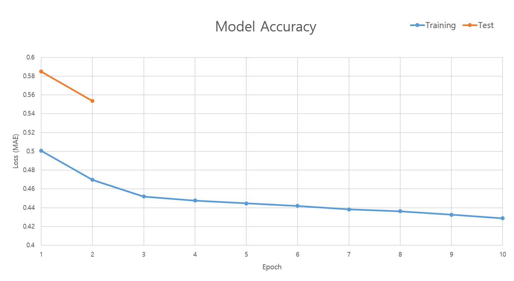

# 머신러닝 기반 요식업 매장 운영관리 솔루션 eyesONE
## Abstract
머신러닝을 사용하여 매점의 판매량을 예측하여 재고 관리를 용의하게 해 주는 서비스를 설계한다.

***

### 활용 데이터
드럭 스토어의 지역구 단위의 판매 물품 종류와 판매량을 하루 단위로 기록한 시계열 데이터를 Raw Dataset으로 사용함

***

### 모델링
시계열 분석에 유리한 RNN(순환 신경망)의 일종인 LSTM(Long Short Term Memory) 모델을 사용하여 Seq-to-Seq 모델을 구성함

일반 LSTM이 아닌 Bidirectional (양방향) LSTM 모델을 구성하여 모델의 정확도를 더 높일 수 있었음

***

### 전처리
정규화 (Regularization)를 거친 32일치의 데이터를 Input Data로, 이후의 7일치의 데이터를 Output Data로 패키징하여 학습 데이터셋을 구성하였음

총 607개의 데이터 중, 500개를 학습 데이터셋으로, 107개를 테스트 데이터셋으로 구분하였고, 학습 데이터셋 중, 100개를 검증 데이터셋으로 구분하였음

***

### 학습
`Adam Optimizer`를 옵티마이저로, `MAE (Mean Absolute Error)`를 오차 함수로 사용하여 모델을 학습시킴

모델의 학습 데이터셋 정확도와 테스트 데이터셋 정확도는 다음과 같음

***

### 예측
학습이 완료된 모델에 32개의 데이터로 구성된 Sequence를 입력값으로 전달하여 예측한 결과, 이후의 7일간의 예측 판매량을 출력 Sequence로 얻을 수 있음

